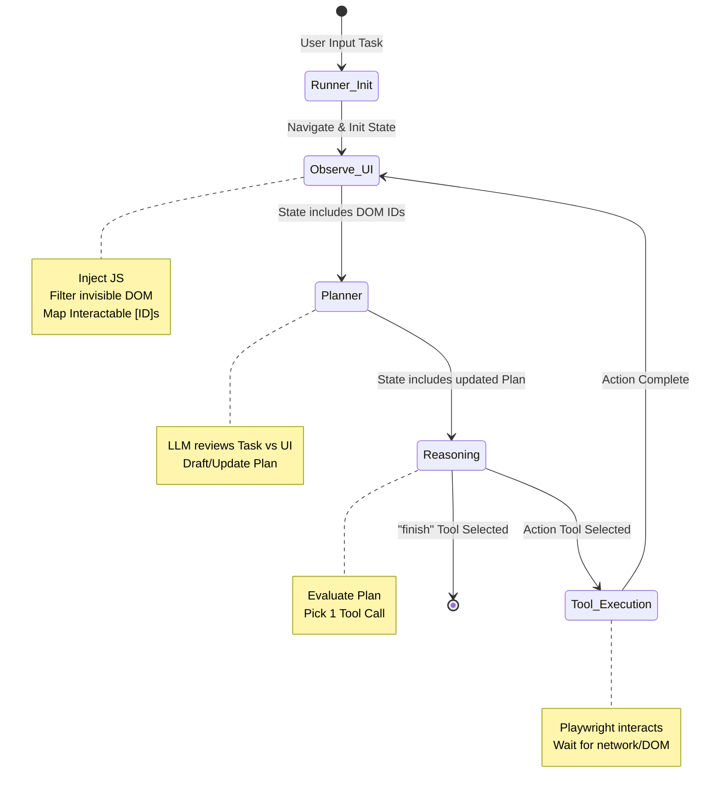

# IT Support Agent

## Agent Core

This directory contains the core intelligence and browser automation loop for the IT Support Agent. The agent marries **LangGraph** (for graph-based state management and LLM reasoning) with **Playwright** (for headless browser automation) to autonomously perform administrative tasks in the IT support panel.

### File Structure

```text
agent_core/
├── __main__.py          # Python execution entry point, routes to runner
├── config.py            # Environment validation and settings
├── browser/             # Playwright browser interaction module
│   ├── observer.py      # Injects JS scripts into the DOM to extract a machine-readable UI tree
│   └── tools.py         # LLM action definitions (click, type_text, select_option, etc.)
├── engine/              # LangGraph orchestration engine
│   ├── graph.py         # Defines the state machine nodes and edges
│   ├── nodes.py         # The actual logic executed at each graph state (Observe, Reason, Tool)
│   ├── runner.py        # Initializes the browser and executes the async interaction loop
│   └── state.py         # `TypedDict` definition for tracking tasks, steps, and history
├── models/              # Pydantic LLM models and core prompts
│   └── prompts.py       # ReAct and planner prompt definitions
└── utils/               # Shared utilities
    └── logger.py        # JSON-structured logging setup for observability
```

### Architecture

The agent is designed around a continuous **ReAct (Reasoning and Acting) loop** powered by a LangGraph state machine.

At a high level, the system separates:
1. **Perception**: Extracting human-readable labels and bounding boxes from the DOM.
2. **Cognition**: Using Gemini (or any structured output LLM) to draft an implementation plan and pick the correct next action to take.
3. **Execution**: Mapping the LLM's selected logical tool (e.g. `click(element_id=3)`) strictly to Playwright automation commands in the active browser context.

### State Machine Flow



### How to Use

The agent core can be run interactively as a CLI, or embedded within a larger service (such as a Telegram Bot).

#### Embedded Execution
You can import and trigger the async generator from other Python modules:
```python
import asyncio
from agent_core.engine.runner import run_task

async def my_script():
    # Pass headed=True to watch the browser work
    result = await run_task("Assign Alice a GitHub Enterprise License", url="http://localhost:8000/", headed=False, max_steps=40)
    print(result)

asyncio.run(my_script())
```

#### Interactive CLI
Change into the root directory of the repository and launch the interactive agent CLI:
```bash
python -m agent_core --url http://localhost:8000/ --headed
```
You can then sequentially pass it natural language prompts to perform. To exit, type `/exit`.

## Admin Panel Portal

This directory (`panel/`) contains the FastAPI web application that serves as the IT Admin Panel. This UI is the environment in which the agent operates and performs tasks.

### Architecture

The admin panel is built using a standard Model-View-Controller (MVC) architecture:

- **FastAPI**: The core web framework routing requests and building the API.
- **Jinja2**: HTML templating engine used to render the frontend views.
- **PostGreSQL**: Database used for storing user and license data.

### File Structure

```text
panel/
├── main.py              # FastAPI application entry point
├── config.py            # Environment and config settings
├── database.py          # Database connection and queries
├── controllers/         # Request handling and business logic
├── models/              # Schema definitions and data access
├── routes/              # API and view route definitions
└── views/               # HTML templates (dashboard, users, etc.)
```

### Running the Panel

To start the admin panel portal locally:
```bash
uvicorn panel.main:app --reload
```
The panel will be available at `http://localhost:8000`. You can perform actions manually or use the agent to automate tasks on this interface.

## Setup & Configuration

Before running the services, you must configure the environment variables required for the database connection and API keys.

1. Copy the provided example environment file to a new `.env` file:
   ```bash
   cp .env.example .env
   ```
2. Open the `.env` file and populate it with your actual credentials:
   - `DATABASE_URL`: Your PostgreSQL connection string.
   - `GEMINI_API_KEY`: Your Google Gemini API key used by the agent.
   - `GEMINI_MODEL`: The specific Gemini model you intend to use (e.g., `gemini-2.5-flash`).
   - `TELEGRAM_BOT_TOKEN`: The bot token obtained from BotFather if setting up the Telegram integration.
